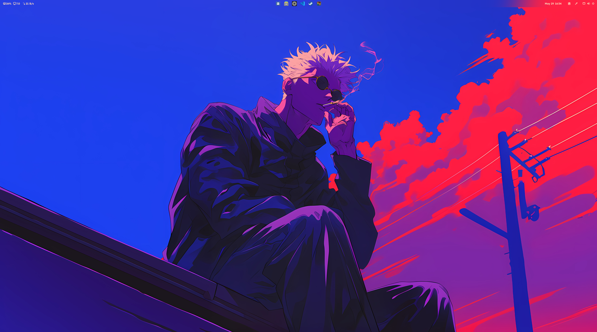
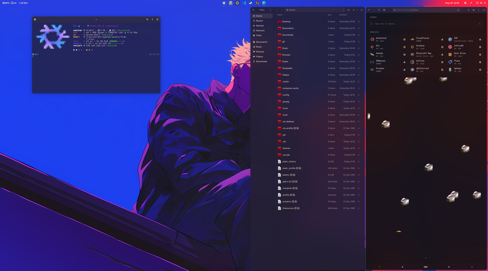
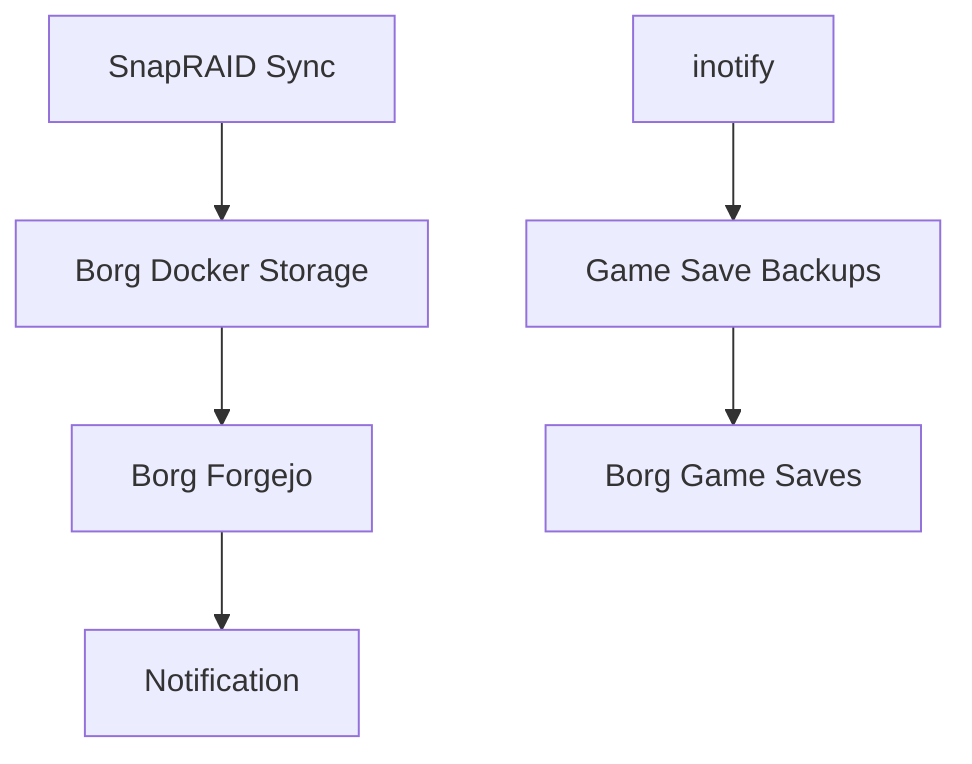

# ❄️ dot.nix

[](https://deepwiki.com/TophC7/dot.nix)

> **My NixOS & Home Manager Multi User/Host Configuration**  
> A modular Nix flake managing multiple systems and users with a focus on reproducibility and ease of maintenance.




---

## 🏗️ Architecture Overview

This repository follows a **layered, modular approach** that separates system-level configurations from user environments, while promoting code reuse across different hosts and users.

```
📁 dot.nix/
├── ❄️ flake.nix                    # Central entry point & dependency management
├── 🔐 secrets.nix                  # Encrypted secrets (git-crypt)
├── 🏠 hosts/                       # System-level configurations
├── 👤 home/                        # User environment configurations  
├── 📦 modules/                     # Reusable configuration modules
├── 🎨 overlays/                    # Package customizations
├── 📋 pkgs/                        # Custom package definitions
└── 🛠️ lib/                         # Helper functions & utilities
```

---

## 🎯 Core Components

### **Flake Management (`flake.nix`)**
The heart of the configuration, managing:
- **External Dependencies**: `nixpkgs`, `home-manager`, `stylix`, hardware modules
- **System Outputs**: Complete NixOS configurations for each host
- **Custom Packages**: Exposed packages from `pkgs/`
- **Overlays**: Package modifications and additions

### **Secret Management**
- **Encryption**: `git-crypt` secures sensitive data in `secrets.nix`
- **Structure**: Defined by `modules/global/secret-spec.nix`
- **Content**: SSH keys, API tokens, hashed passwords, SMTP credentials

### **Configuration Specifications**
- **`host-spec.nix`**: Defines host attributes (hostname, user, hardware type, desktop environment)
- **`secret-spec.nix`**: Structures for secrets, firewall rules, Docker environments, Users, etc

---

## 🏠 System Architecture (`hosts/`)

### **Global Configurations**
```
hosts/global/
├── core/                           # Essential base settings
│   ├── fonts.nix                   # Font management
│   ├── networking.nix              # Network configuration
│   ├── ssh.nix                     # SSH server setup
│   └── user.nix                    # User account setup
└── common/                         # Optional system features
    ├── audio.nix                   # PipeWire audio stack
    ├── gaming.nix                  # Steam, GameMode, hardware optimizations
    ├── gnome.nix                   # GNOME desktop environment
    ├── docker.nix                  # Docker setup
    └── libvirt.nix                 # VM tools and management
```

### **Host-Specific Configurations**
Each system in `hosts/nixos/<hostname>/` contains:
- **`default.nix`**: Main configuration importing globals + host-specific settings
- **`hardware.nix`**: Hardware-specific configuration (bootloader, filesystems, drivers)
- **`config/`**: Service-specific configurations (optional)

#### 🖥️ **Current Hosts**

| Host       | Type          | Purpose                | Hardware                    | Services                          |
| ---------- | ------------- | ---------------------- | --------------------------- | --------------------------------- |
| **rune**   | Desktop       | My workstation         | Ryzen 9 7900X3D, RX 9070 XT | Gaming, Development, VMs          |
| **gojo**   | Desktop       | Giovanni's workstation | Ryzen CPU, RX 6950 XT       | Gaming, Development               |
| **haze**   | Desktop       | Cesar's workstation    | Ryzen 7, RX 6950 XT         | Gaming, Development               |
| **cloud**  | LXC Container | Storage & NFS          | 4C/4GB                      | File storage, NFS server, Backups |
| **komodo** | LXC Container | Docker orchestration   | 12C/30GB                    | Authentik, Komodo, Web services   |
| **proxy**  | LXC Container | Network proxy          | 3C/2GB                      | Cloudflare tunnels, Caddy         |
| **nix**    | LXC Container | Development server     | 10C/12GB                    | Remote development, VSCode server |
| **vm**     | VM            | Testing environment    | Variable                    | System testing                    |

---

## 👤 User Environment (`home/`)

### **Global Home Configurations**
```
home/global/
├── core/                           # Essential user tools
│   ├── fastfetch/                  # System info shell prompt with custom scripts
│   ├── fish/                       # Shell configuration
│   ├── git.nix                     # Git setup with signing
│   └── ssh.nix                     # SSH client configuration
└── common/                         # Optional user applications
    ├── gaming/                     # Gaming tools & emulator backups
    ├── gnome/                      # GNOME-specific programs & settings
    ├── vscode/                     # VS Code with patched SSH
    └── zen.nix                     # Zen browser configuration
```

### **User-Specific Configurations**
Each user in `home/users/<username>/` includes:
- **Theme Configuration**: Stylix-based theming with custom color schemes
- **Host Adaptations**: Per-host overrides in `home/hosts/<hostname>/`

#### 👥 **Current Users**

| User      | Theme                    | Primary Host | Desktop Setup   |
| --------- | ------------------------ | ------------ | --------------- |
| **toph**  | Invincible (blue/yellow) | rune         | GNOME + PaperWM |
| **gio**   | Gojo (red/white)         | gojo         | GNOME + PaperWM |
| **cesar** | Soraka (purple/violet)   | haze         | GNOME + PaperWM |

---

## 🎨 Theming & Customization

### **Stylix Integration**
- **Unified Theming**: Base16 color schemes applied system-wide
- **Custom Schemes**: User-specific YAML color definitions
- **Coverage**: GTK, terminal, VS Code (optional), wallpapers
- **Fonts**: Consistent typography (Lexend, Monocraft, Laila)

### **GNOME Customization**
- **Window Management**: PaperWM for tiling workflow
- **Extensions**: Blur My Shell, Vitals, Pano clipboard, custom keybindings, ...
- **Per-User**: Customized dconf settings for each user's workflow

---

## 🔧 Notable Features

### **🎮 Gaming Infrastructure**
- **Steam Integration**: Proton, GameScope, GameMode optimizations
- **Emulator Backup System**: Automated Borg backups for save files
  ```nix
  # Automatic save backup for Ryujinx with inotify monitoring
  borg-wrapper -p "~/.config/Ryujinx/bis/user/save" 
               -o "/pool/Backups/Switch/RyubingSaves" 
               -m 30 -- ryujinx
  ```
- **Hardware Optimization**: AMD GPU settings, VRR support

### **🗄️ Storage & Backup Strategy**

#### **Cloud Host (Storage Server)**
- **MergerFS Pool**: Unified storage across multiple drives
- **NFS Export**: Mounted as `/pool` on other hosts
- **SnapRAID Protection**: Parity-based data protection
- **Borg Backups**: Incremental backups for critical data

#### **Backup Chain**


### **🐳 Container Management**
- **Komodo Integration**: Docker stack management through web UI
- **Service Definitions**: Authentik SSO, Caddy reverse proxy, various applications
- **compose2nix**: Docker Compose files converted to NixOS modules

### **🔐 Security & Access**
- **SSH Key Management**: Automated deployment of public/private keys
- **Cloudflare Integration**: Zero Trust tunnels for external access
- **ACME Certificates**: Automated Let's Encrypt with DNS challenge

---

## 🚀 Usage & Deployment

### **Initial System Installation**

For setting up a new system (in NixOS) with this configuration:

#### **1. Clone Configuration Repository**
```bash
# Get yay.nix temporarily for installation
nix shell github:Tophc7/yay.nix --extra-experimental-features flakes --extra-experimental-features nix-command --no-write-lock-file

# Clone the configuration repository using yay try
yay try git git-crypt micro
cd ~/Documents/
git clone https://github.com/tophc7/dot.nix
```

#### **2. Unlock Encrypted Secrets**
```bash
cd ~/Documents/dot.nix
git-crypt unlock <<path/to/symmetric.key>> # Or use GPG key
```

#### **3. Configure Hardware Settings**
1. **Compare hardware configurations:**
   ```bash
   micro ~/Documents/dot.nix/hosts/nixos/gojo/hardware.nix
   micro /etc/nixos/hardware-configuration.nix
   ```

2. **Update hardware.nix** with the `fileSystems` and `swapDevices` from the generated `/etc/nixos/hardware-configuration.nix`

#### **4. Install Configuration (TTY)**
1. **Switch to TTY**: `Ctrl+Alt+F2`
2. **Login to TTY**
3. **Rebuild system:**
   ```bash
   nix shell github:Tophc7/yay.nix --extra-experimental-features flakes --extra-experimental-features nix-command --no-write-lock-file
   yay rebuild -H gojo -p ~/Documents/dot.nix -e
   sudo reboot -f
   ```

### **Day-to-Day System Management**

Once installed, use the integrated `yay` tool for all system management:

```bash
# Build and switch system configuration
yay rebuild

# Update flake inputs
yay update

# Clean up system
yay garbage

# Try packages temporarily
yay try fastfetch -- fastfetch

# Create archives
yay tar myfiles/

# Extract archives  
yay untar myfiles.tar.zst
```

### **Environment Variables**
- **`FLAKE`**: Set to your flake directory to avoid using `-p` flag repeatedly
  ```bash
  export FLAKE="$HOME/Documents/dot.nix"
  yay rebuild  # Will automatically use $FLAKE path
  ```

### **Custom Tools Integration**
- **`yay`**: Primary rebuild and management tool (see [yay.nix](https://github.com/Tophc7/yay.nix))
- **`nh`**: Nix helper for cleaner rebuild output  
- **`borgtui`**: Custom TUI for managing Borg repositories

---

## 📚 Development Philosophy

### **Modularity**
- **Separation of Concerns**: System vs. user configurations
- **Reusable Components**: Shared modules across hosts
- **Parameterization**: Host specs drive configuration choices

### **Maintainability**
- **Structured Secrets**: Clearly defined secret specifications
- **Documentation**: Inline comments and clear naming
- **Testing**: VM configurations for safe testing

### **Flexibility**
- **Multiple Users**: Support for different users with different preferences
- **Host Adaptation**: Same user config adapts to different machines
- **Service Composition**: Mix and match services per host needs

---

## 🔗 Key Technologies

| Category           | Technologies                          |
| ------------------ | ------------------------------------- |
| **Core**           | NixOS, Home Manager, Nix Flakes       |
| **Desktop**        | GNOME, PaperWM, Stylix                |
| **Virtualization** | libvirt, QEMU, LXC containers         |
| **Storage**        | MergerFS, SnapRAID, BorgBackup, NFS   |
| **Containers**     | Docker, Komodo                        |
| **Security**       | git-crypt, ACME, Cloudflare           |
| **Monitoring**     | Apprise notifications, systemd timers |

---

## 📝 Quick Reference

### **Directory Structure**
- `hosts/nixos/<name>/` - System configurations
- `home/users/<name>/` - User environments  
- `home/hosts/<name>/` - Host-specific user overrides
- `modules/global/` - Shared specifications
- `pkgs/` - Custom packages
- `secrets.nix` - Encrypted secrets (git-crypt)

### **Key Files**
- `flake.nix` - Dependency management & outputs
- `shell.nix` - Recovery environment
- `modules/global/host-spec.nix` - Host attribute definitions
- `modules/global/secret-spec.nix` - Secret structure definitions

This configuration emphasizes **reproducibility**, **security**, and **maintainability** while supporting a complex multi-user, multi-host homelab environment. I quite love it, hope it serves as inspo to some of you out there.