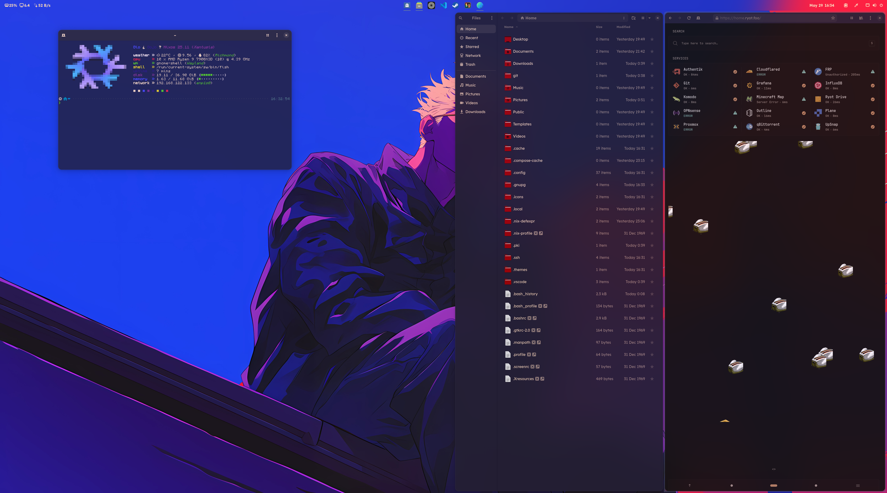
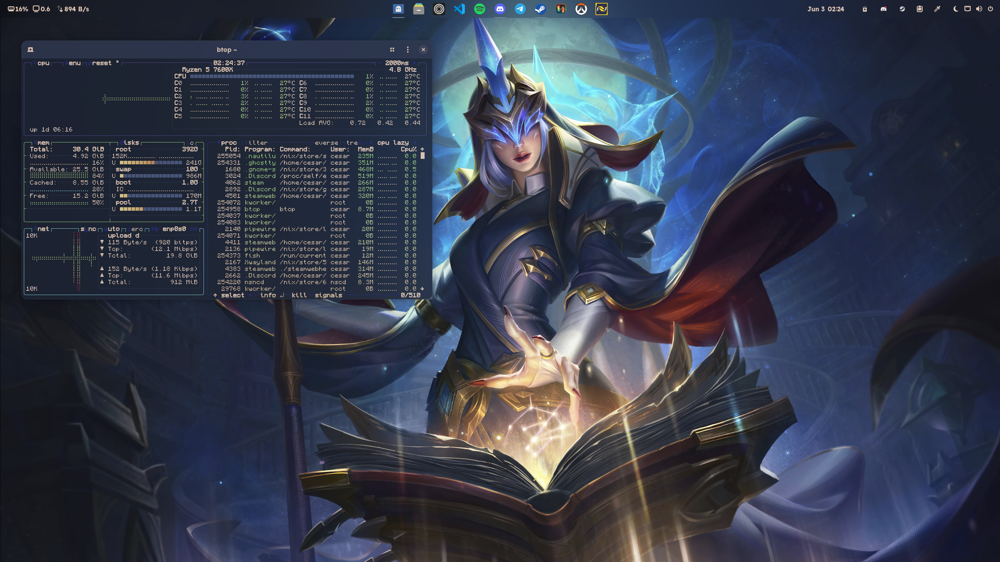

# ❄️ dot.nix

[](https://deepwiki.com/TophC7/dot.nix)

> **My NixOS & Home Manager Multi User/Host Configuration**
> A modular Nix flake managing multiple systems and users with a focus on reproducibility and ease of maintenance.




---

## 🏗️ Architecture Overview

This repository follows a **layered, modular approach** that separates system-level configurations from user environments, while promoting code reuse across different hosts and users.

```
📁 dot.nix/
├── ❄️ flake.nix                    # Central entry point & dependency management
├── 🔐 secrets.nix                  # Encrypted secrets (git-crypt)
├── 🏠 hosts/                       # System-level configurations
│   ├── x86/                        # Intel/AMD 64-bit systems
│   └── arm/                        # ARM64 systems
├── 👤 home/                        # User environment configurations
├── 📦 modules/                     # Reusable configuration modules
├── 🎨 overlays/                    # Package customizations
├── 📋 pkgs/                        # Custom package definitions
├── 🛠️ lib/                         # Helper functions & utilities
├── 🔧 iso/                         # ISO build configurations
└── ⚙️ .github/workflows/           # CI/CD automation
```

---

## 🎯 Core Components

### **Flake Management (`flake.nix`)**
The heart of the configuration, managing:
- **External Dependencies**: `nixpkgs`, `home-manager`, `stylix`, `hardware modules`, `solaar`, `snapraid-aio`, `chaotic`
- **System Outputs**: Complete NixOS configurations for each host
- **Custom Packages**: Exposed packages from `pkgs/`
- **Overlays**: Package modifications and additions

### **Secret Management**
- **Encryption**: `git-crypt` secures sensitive data in `secrets.nix`
- **Structure**: Defined by `modules/global/secret-spec.nix`
- **Content**: SSH keys, API tokens, hashed passwords, SMTP credentials

### **Configuration Specifications**
- **`host-spec.nix`**: Defines host attributes (hostname, user, hardware type, desktop environment, `isMinimal` for server configurations)
- **`secret-spec.nix`**: Structures for secrets, firewall rules, Docker environments, Users, etc
  - Example [secrets.nix](/lib/public/secrets.example.nix)

---

## 🏠 System Architecture (`hosts/`)

### **Global Configurations**
```
hosts/global/
├── core/                           # Essential base settings
│   ├── default.nix                 # Core system imports & Nix configuration
│   ├── fonts.nix                   # Font management
│   ├── networking.nix              # Network configuration
│   ├── ssh.nix                     # SSH server setup
│   └── user.nix                    # User account setup & Home Manager integration
└── common/                         # Optional system features
    ├── audio.nix                   # PipeWire audio stack
    ├── gaming.nix                  # Steam, GameMode, hardware optimizations
    ├── gnome.nix                   # GNOME desktop environment
    ├── docker.nix                  # Docker setup with update-containers script
    ├── libvirt.nix                 # VM tools and management
    ├── warp.nix                    # Cloudflare WARP VPN support
    └── system/
        ├── pool.nix                # NFS pool mounting & symlink management
        └── lxc.nix                 # Central hardware configuration for LXC hosts
```

### **Host-Specific Configurations**
Each system in `hosts/nixos/<hostname>/` contains:
- **`default.nix`**: Main configuration importing globals + host-specific settings
- **`hardware.nix`**: Hardware-specific configuration (bootloader, filesystems, drivers)
- **`config/`**: Service-specific configurations (optional)

#### 🖥️ **Current Hosts**

| Host       | Type          | Purpose                | Hardware                    | Services                         |
| ---------- | ------------- | ---------------------- | --------------------------- | -------------------------------- |
| **rune**   | Desktop       | My workstation         | Ryzen 9 7900X3D, RX 9070 XT | Gaming, Development, VMs         |
| **gojo**   | Desktop       | Giovanni's workstation | Ryzen 7 7800X3D, RX 7900 XT | Gaming, Development              |
| **haze**   | Desktop       | Cesar's workstation    | Ryzen 7, RX 6950 XT         | Gaming, Development              |
| **caenus** | Server        | Oracle VPS             | ARM 4vCPU, 24GB RAM, 200GB  | FRP, Public IP                   |
| **sock**   | Server        | Backup & Storage       | Intel N150                  | Komodo (Docker), Backups, Newt   |
| **cloud**  | LXC Container | Storage & NFS          | 4C/4GB                      | File storage, NFS, Newt          |
| **komodo** | LXC Container | Docker orchestration   | 12C/30GB                    | Authentik, Komodo (Docker), Newt |
| **proxy**  | LXC Container | Network proxy          | 3C/2GB                      | Pangolin, AdGuard, Newt          |
| **nix**    | LXC Container | Development server     | 10C/12GB                    | **Not Deployed ATM**             |
| **vm**     | VM            | Testing environment    | Variable                    | System testing                   |

---

## 👤 User Environment (`home/`)

### **Global Home Configurations**
```
home/global/
├── core/                           # Essential user tools
│   ├── fastfetch/                  # System info shell prompt with custom scripts
│   ├── fish/                       # Shell configuration
│   ├── git.nix                     # Git setup with signing
│   └── ssh.nix                     # SSH client configuration
└── common/                         # Optional user applications
    ├── gaming/                     # Gaming tools & emulator backups
    │   └── switch.nix              # Nintendo Switch emulator with Borg backups
    ├── gnome/                      # GNOME-specific programs & settings
    │   └── dconf.nix               # Enhanced PaperWM & extension configs
    ├── vscode/                     # VS Code with patched SSH
    ├── xdg.nix                     # XDG directory & file associations
    └── zen.nix                     # Zen browser configuration
```

### **User-Specific Configurations**
Each user in `home/users/<username>/` includes:
- **Theme Configuration**: Stylix-based theming with custom color schemes
- **Host Adaptations**: Per-host overrides in `home/hosts/<hostname>/`

#### 👥 **Current Users**

| User      | Theme                    | Primary Host | Desktop Setup   |
| --------- | ------------------------ | ------------ | --------------- |
| **toph**  | Invincible (blue/yellow) | rune         | GNOME + PaperWM |
| **gio**   | Gojo (red/white)         | gojo         | GNOME + PaperWM |
| **cesar** | Soraka (purple/violet)   | haze         | GNOME + PaperWM |

---

## 🎨 Theming & Customization

### **Stylix Integration**
- **Unified Theming**: Base16 color schemes applied system-wide
- **Custom Schemes**: User-specific YAML color definitions
- **Coverage**: GTK, terminal (`ghostty`), VS Code (optional), wallpapers
- **Fonts**: Consistent typography (Lexend, `Monocraft Nerd Fonts`, Laila)

### **GNOME Customization**
- **Window Management**: PaperWM for tiling workflow
- **Extensions**: Blur My Shell, Vitals, Pano clipboard, custom keybindings, ...
- **Per-User**: Customized dconf settings for each user's workflow

---

## 🔧 Notable Features

### **🎮 Enhanced Gaming**
- **Optimized Stack**: Steam integration with Proton, GameScope, and GameMode.
- **Automated Emulator Backups**: `borg-wrapper` script (Fish-based) leverages `inotify-tools` and `borgbackup` for automatic, incremental save file backups for emulators like Ryujinx.
  ```nix
  # Example: Automatic save backup for Ryujinx
  borg-wrapper -p "~/.config/Ryujinx/bis/user/save" \
               -o "/pool/Backups/Switch/RyubingSaves" \
               -m 30 -- ryujinx
  ```
- **Hardware Tuning**: Includes AMD GPU specific settings (e.g., `lact` for tuning) and Variable Refresh Rate (VRR) support.

### **🗄️ Robust Storage & Backups**
- **Centralized Storage (Cloud Host)**: Utilizes a MergerFS pool for unified drive access, exported via NFS (mounted as `/pool` on other hosts).
- **Data Integrity**: SnapRAID provides parity-based data protection for the storage pool.
- **Comprehensive Backups**: Provides incremental backups of critical data, like Docker volumes and Forgejo instances, with Apprise notifications.
- **Automated Backup Chain**: Systemd timers orchestrate SnapRAID syncs and Borg backups.

### **🖥️ Streamlined Desktop & User Experience**
- **Custom Fish Shell**: Enhanced with the Tide prompt, `grc` for colorized output, and some utility functions
- **Modern Terminal**: `ghostty` as the default terminal emulator, themed with Stylix.
- **Efficient File Management**: `yazi` configured as the terminal file manager.
- **Curated Applications**: Includes configurations for applications like the Zen browser and VS Code.
- **XDG & Mime Associations**: Sensible default applications configured via `xdg.mimeApps`, using `handlr-regex` for flexibility.

### **🐳 Advanced Container Management**
- **Docker Orchestration**: Komodo provides a web UI for managing Docker stacks.
- **Key Services**: Pre-defined declarative configurations for services like Authentik (SSO) and Pangolin (reverse proxy).
- **Declarative Stacks**: `compose2nix` is used to convert Docker Compose files into NixOS declarative modules for services like FileRun, Authentik, etc.

### **🔐 Integrated Security**
- **Encrypted Secrets**: `git-crypt` for managing sensitive data in git.
- **Secure Remote Access**: Cloudflare Tunnels for Zero Trust access to services.
- **Automated Certificates**: ACME (Let's Encrypt) with DNS challenges for SSL/TLS.
- **SSH Key Deployment**: Automated management and deployment of SSH keys.

---

## 🚀 Usage & Deployment

### **Initial System Installation**

For setting up a new system (in NixOS) with this configuration:

#### **1. Clone Configuration Repository**
```bash
# Enter development shell with necessary tools for installation
nix develop github:TophC7/dot.nix --extra-experimental-features "flakes nix-command"

# Clone the configuration repository using yay try
FLAKE=~/Documents/dot.nix
cd ~/Documents
git clone https://github.com/tophc7/dot.nix
```

#### **2. Unlock Encrypted Secrets**
```bash
cd ~/Documents/dot.nix
git-crypt unlock <<path/to/symmetric.key>> # Or use GPG key
```

<details>
<summary><b>Setup Your Own Secrets</b></summary>

Since you won't have access to the encrypted secrets, create your own:

```bash
cd ~/Documents/dot.nix

# Copy the example and customize it
cp lib/public/secrets.example.nix secrets.nix

# Edit with your credentials, SSH keys, etc.
micro secrets.nix

# Initialize git-crypt for your secrets
git-crypt init
git-crypt add-gpg-user YOUR_GPG_KEY_ID
```

After setting up your secrets, encrypt the file:
```bash
git add secrets.nix
git-crypt lock
```

</details>

#### **3. Configure Hardware Settings**
1. Compare hardware configurations:
   ```bash
   # Note: path structure (hosts/x86/ or hosts/arm/)
   micro ~/Documents/dot.nix/hosts/x86/gojo/hardware.nix
   micro /etc/nixos/hardware-configuration.nix
   ```

2. Update hardware.nix with the `fileSystems` and `swapDevices` from the generated `/etc/nixos/hardware-configuration.nix`

#### **4. Install Configuration (TTY Recommended)**
1. Switch to TTY: `Ctrl+Alt+F2` (to avoid desktop service conflicts)
2. Login to TTY
3. Rebuild system:
   ```bash
   # Enter development shell again with necessary tools for installation
   nix develop github:TophC7/dot.nix --extra-experimental-features "flakes nix-command"

   # Rebuild with your host configuration
   yay rebuild -H your-hostname -p ~/Documents/dot.nix
   sudo reboot -f
   ```

### **Day-to-Day System Management**

Once installed, use the integrated `yay` tool for all system management:

```bash
# Build and switch system configuration
yay rebuild

# Update flake inputs
yay update

# Clean up system
yay garbage

# Try packages temporarily
yay try fastfetch -- fastfetch

# Create archives
yay tar myfiles/

# Extract archives
yay untar myfiles.tar.zst
```

### **Environment Variables**
- **`FLAKE`**: Set to your flake directory to avoid using `-p` flag repeatedly
  ```bash
  export FLAKE="$HOME/Documents/dot.nix"
  yay rebuild  # Will automatically use $FLAKE path
  ```

---

## 🔧 ISO Generation

### **Automated Build System**
- **GitHub Actions**: CI/CD pipeline for ISO releases
- **Variants**: Server (minimal) and Desktop (GNOME) ISOs
- **Architectures**: x86_64 and aarch64 support with optimized builds
- **Cross-compilation**: ARM ISOs can be built on x86_64 systems
- **Distribution**: Automatic releases with artifact uploads (X86 only)

### **Local Building**
```bash
# Build locally
cd iso
nix build .#server-iso-x86
nix build .#desktop-iso-arm

# Cross-compile ARM ISOs on x86_64 systems 
nix build .#server-iso-arm --system x86_64-linux --extra-platforms aarch64-linux
```

---
## 📚 Development Philosophy

### **Modularity**
- **Separation of Concerns**: System vs. user configurations
- **Reusable Components**: Shared modules across hosts
- **Parameterization**: Host specs drive configuration choices

### **Maintainability**
- **Structured Secrets**: Clearly defined secret specifications
- **Documentation**: Inline comments and clear naming
- **Testing**: VM configurations for safe testing

### **Flexibility**
- **Multiple Users**: Support for different users with different preferences
- **Host Adaptation**: Same user config adapts to different machines
- **Service Composition**: Mix and match services per host needs

---

## 🔗 Key Technologies

| Category           | Technologies                                         |
| ------------------ | ---------------------------------------------------- |
| **Core**           | NixOS, Home Manager, Nix Flakes                      |
| **Shell**          | Fish Shell, Tide Prompt                              |
| **Desktop**        | GNOME, PaperWM, Stylix, Ghostty, Yazi                |
| **Virtualization** | libvirt, QEMU, LXC                                   |
| **Storage**        | MergerFS, SnapRAID, BorgBackup, NFS, `inotify-tools` |
| **Containers**     | Docker, Komodo, compose2nix                          |
| **Networking**     | Newt, Pangolin, AdGuard Home, Cloudflare WARP        |
| **Reverse Proxy**  | Traefik (via Pangolin)                               |
| **Security**       | git-crypt, ACME, Zero Trust tunneling                |
| **Development**    | VS Code (Patched SSH), `nixfmt`, `biome`             |
| **Gaming**         | Steam, Proton, GameScope, GameMode, `lact`           |
| **Monitoring**     | Apprise notifications, systemd timers                |
| **CI/CD**          | GitHub Actions, Automated ISO builds                 |

---9;ulj]

## 📝 Quick Reference

### **Key Configuration Files**
- `secrets.nix` - Encrypted secrets (git-crypt)
- `modules/global/host-spec.nix` - Host attribute definitions
- `modules/global/secret-spec.nix` - Secret structure definitions
- `modules/nixos/newt.nix` - Newt tunneling service module
- `flake.nix` - Main dependency management & host discovery
- `iso/flake.nix` - ISO generation configuration

### **Frequently Modified Directories**
- `home/users/<name>/` - Individual user configurations
- `home/global/` - Shared user settings & applications
- `hosts/global/` - System-wide shared configurations
- `hosts/{x86,arm}/<name>/` - Host-specific system configs
- `home/hosts/<name>/` - Host-specific user overrides
- `pkgs/` - Custom package definitions

### **Development Workflow**
- `shell.nix` - Recovery environment for troubleshooting
- `.github/workflows/` - CI/CD for ISO builds
- `iso/` - ISO build system (separate flake)

---

## 👥 Credits & Acknowledgments

This configuration is built upon the excellent foundation provided by **[EmergentMind's configuration](https://github.com/EmergentMind/nix-config)**. Many core architectural decisions and implementation patterns draw heavily from their work, including but not limited to:

- **Host Specification System**: The `host-spec.nix` pattern and `mkHost` function structure
- **Modular Architecture**: The separation of system and user configurations

A huge thank you to EmergentMind for creating such a well-structured and educational NixOS configuration that serves as my introduction to NixOS and its wonders. Their work made this homelab setup possible and continues to influence It.

---

This configuration emphasizes **reproducibility**, **security**, and **maintainability** while supporting a complex multi-user, multi-host homelab environment. I quite love it, hope it serves as inspo to some of you out there.