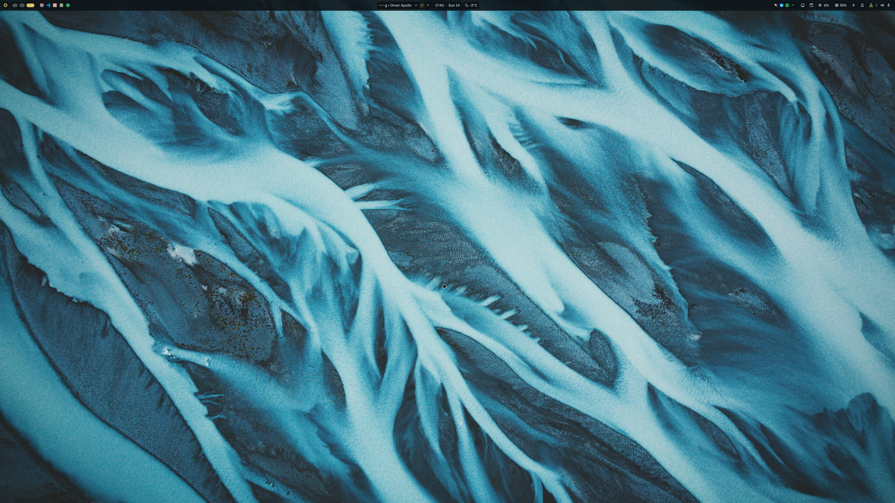
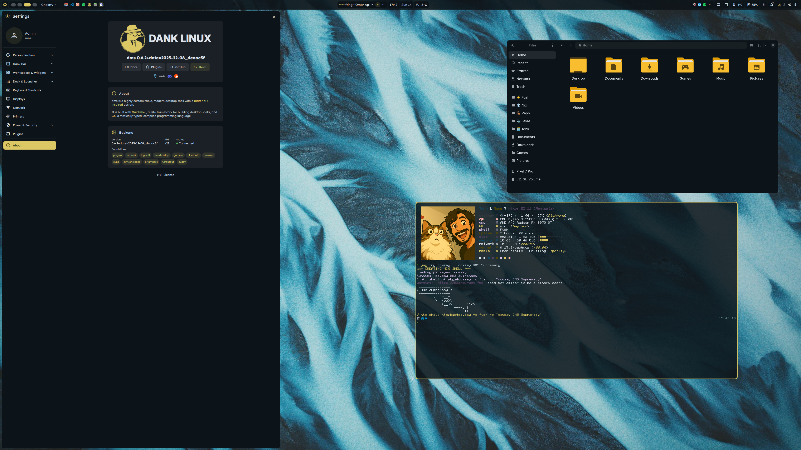
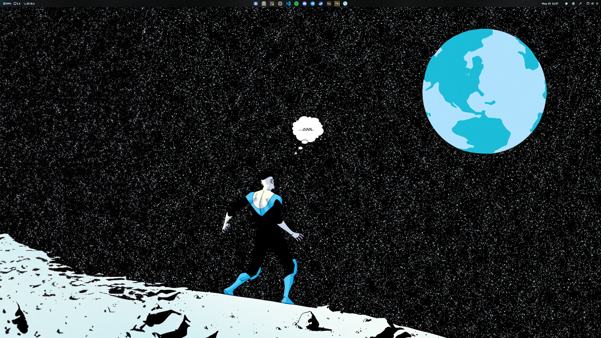
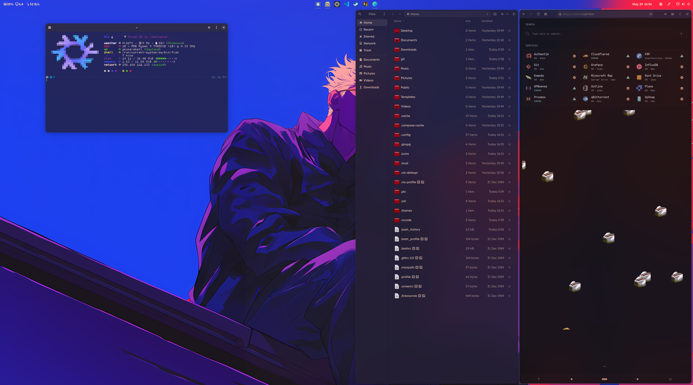
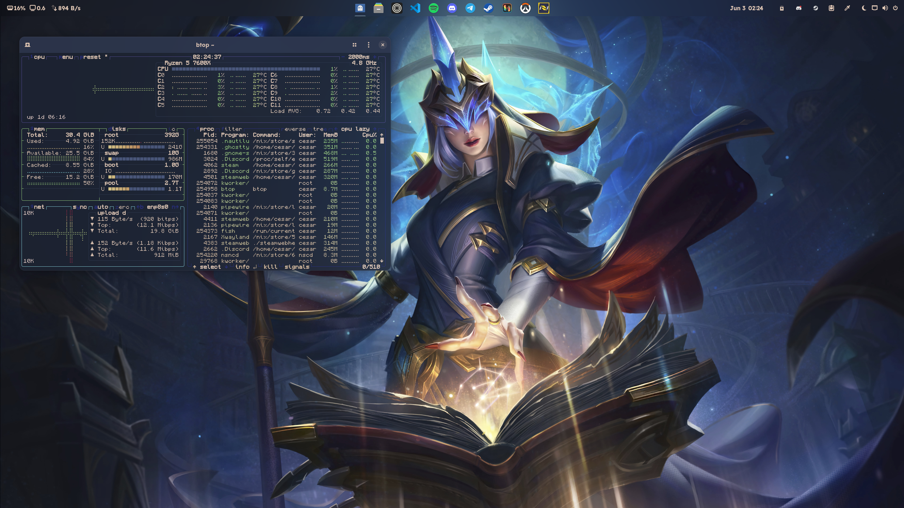

<h1> dot.nix</h1>

> **My NixOS & Home Manager Multi User/Host Configuration**
> A modular Nix flake managing multiple systems and users with a focus on reproducibility and ease of maintenance.
>
> [](https://deepwiki.com/TophC7/dot.nix)






---

## The Fleet

Every machine has a designated role, managed declaratively from this repository.

| Host | Form | Hardware | Role & Highlights |
| :--- | :--- | :--- | :--- |
| **rune** | Workstation | Ryzen 9 7900X3D<br>Radeon RX 9070 XT<br>32GB RAM | **Primary battle station.** Niri Wayland compositor + Pana desktop, Switch 2 controllers (`play.switch2Controllers`), Waydroid, Solaar, full homelab NFS mounts. |
| **norion** | Laptop | Lenovo ThinkPad P14s Gen 6<br>Ryzen AI 9 HX PRO 370<br>64GB RAM | **Mobile workstation.** GNOME, private Cachix cache (`psynk-private`), WireGuard roaming VPN, homelab NFS mounts. |
| **meowl** | SFF Desktop | Dell OptiPlex 3080<br>Intel Core i5-10505<br>GeForce RTX 3050 6GB OEM | **Always-on desktop & game streamer.** GNOME, Sunshine streaming host for remote play, Newt zero-trust tunnel. |
| **nimbus** | NAS & Builder | Ryzen 7 5700X<br>32GB RAM | **Storage backbone & remote builder.** ZFS + BTRFS storage pools, NFS exports (`/tank`, `/fast`, `/repo`), Explorer file server, PocketBase, dedicated remote builder for `bonk`, `nix-serve` binary cache. |
| **zebes** | Homelab | Ryzen 5 5600G<br>Radeon RX 7900 GRE<br>32GB RAM | **Compute & AI engine.** `llama-cpp` LLM inference with Vulkan acceleration, Komodo container orchestration core, dedicated game servers (Minecraft, Astroneer, Enshrouded). |
| **nexus** | Router | Intel N150 (4C/4T)<br>8GB RAM<br>4x Intel I226-V 2.5GbE | **Network core & edge gateway.** Dedicated 2.5GbE router (NAT, routing, DHCP), AdGuard Home DNS sinkhole, Pangolin reverse proxy stack (Gerbil + Traefik), WireGuard VPN server, Rathole tunnels. |
| **caenus** | Cloud VPS | Oracle Cloud ARM64<br>4 vCPU, 24GB RAM | **Public ingress & relay.** Public IP endpoint, Rathole tunnel server, WireGuard OLM gateway. |
| **vm** | VM | Variable | **Disposable sandbox** for testing system configs and experimental modules. |

> [!NOTE]
> WireGuard mesh configurations also support client-only endpoints like **husky** and **sammy** without building dedicated system closures.

---

## The Desktop Experience

The workstations run a custom Wayland environment centered around fluidity, keyboard-driven navigation, and automatic Material Design color harmonies.

* **Compositor & Shell:** [Niri](https://github.com/tophc7/niri-flake) scrollable tiling Wayland compositor paired with **Pana** — Toph's custom pure-Rust desktop shell (actively replacing legacy Quickshell DMS). Workstations and streamers also provide GNOME with custom extensions like `copyous`.
* **Dynamic Material Theming:** Wallpaper colors are extracted on the fly via [Matugen](https://github.com/InioX/Matugen) and applied across Stylix and system styling. Pana generates matching ANSI-16 palettes for terminals, keeping shell colors synchronized with the active wallpaper.
* **Curated App Stack:**
  * **Editor:** [Sworm](https://github.com/tophc7/sworm) (default editor mapped to all text and code MIME types) and VS Code.
  * **Terminal:** [Ghostty](https://ghostty.org/) with [Fish](https://fishshell.com/) (Tide prompt, GRC syntax colorization, custom abbreviations).
  * **Browser:** [Zen Browser](https://zen-browser.app/) with shared profiles.
  * **Navigation & Launchers:** [Vicinae](https://github.com/vicinaehq/vicinae) and application search.
  * **File Management:** Nautilus and Yazi.

---

## Homelab & Infrastructure

* **Distributed Storage:** Centralized NFS architecture mounting `/tank` (cold storage), `/fast` (fast SSD storage), `/repo` (code repositories), and `/store` (service state) across machines with systemd automount.
* **Containers & Orchestration:** Managed via [Komodo](https://komodo.ryot.foo) with periphery agents across servers, paired with declarative `oci-stacks` for Explorer, PocketBase, and game servers.
* **Edge & Zero-Trust Networking:**
  * **Pangolin Stack:** Gerbil, Pangolin, and Traefik running on Nexus for SSL termination and reverse proxying with Cloudflare DNS challenges.
  * **Zero Trust & Tunnels:** Newt tunnels and Rathole reverse tunnels forward services securely to public endpoints without exposing home IP addresses.
  * **AdGuard Home & WireGuard:** Whole-network DNS filtering and roaming VPN access.

---

## Custom Tooling

A collection of bespoke tools built to run this setup smoothly:

| Tool | Purpose |
| :--- | :--- |
| **[`mix.nix`](https://github.com/tophc7/mix.nix)** | Reusable flake architecture engine handling multi-host generation, API v2 discovery, secrets, and module wiring. |
| **[`bonk`](https://github.com/tophc7/bonk)** | Daily NixOS workflow multitool wrapping `nh`, system rebuilds, remote building on Nimbus, and generation cleanup. |
| **[`sworm`](https://github.com/tophc7/sworm)** | Fast, lightweight code editor built for modern terminal and desktop workflows. |
| **[`pana`](https://github.com/tophc7/pana)** | Custom pure-Rust Wayland desktop shell, material theming engine, and system widgets. |
| **[`play.nix`](https://github.com/tophc7/play.nix)** & **[`wayscope`](https://github.com/tophc7/wayscope)** | Gaming stack with Switch 2 controller integration, GameMode, and Wayland Gamescope profiles. |

---

## Layout

Built on **mix.nix API v2**, using a clean, discovery-based structure where NixOS and Home Manager code live together naturally:

```
dot.nix/
├── hosts/                  # Machine definitions (NixOS + optional host home/)
│   ├── rune/               # Workstation: default.nix, hardware.nix, home/, config/
│   ├── norion/             # Laptop: default.nix, hardware.nix, home/, config/
│   ├── meowl/              # Game streamer: default.nix, hardware.nix, home/, config/
│   ├── nimbus/             # Storage server: default.nix, hardware.nix, config/
│   ├── zebes/              # Compute server: default.nix, hardware.nix, config/
│   ├── nexus/              # Router: default.nix, hardware.nix, config/
│   ├── caenus/             # VPS: default.nix, hardware.nix, config/
│   └── vm/                 # VM canvas: default.nix, hardware.nix, home/
├── modules/
│   ├── core/               # Global baseline for all hosts (NixOS + core home/ for fish, git, btop, etc.)
│   ├── features/           # Optional building blocks loaded by name via lib.features
│   │   ├── desktop/        # Niri, Pana, GNOME, nautilus, shared configs
│   │   ├── gaming/         # Steam, Play, controller tweaks
│   │   ├── docker/         # Container runtime
│   │   ├── sworm/          # Sworm editor integration
│   │   ├── zen/            # Zen browser config
│   │   └── ...             # audio, bluetooth, solaar, vpn, xdg, etc.
│   └── users/toph/         # User profile, Fastfetch logo, wallpapers
├── mix/                    # mix.nix flake-parts module (host/user declarations, hostSpec schema, secrets)
└── dist/                   # Minimal standalone installer ISOs extending this flake
```

### Selecting Features

Hosts pick features cleanly with `lib.features`:

```nix
imports = lib.flatten [
  ./hardware.nix
  ./config
  (lib.features [
    "audio"
    "bluetooth"
    "docker"
    "gaming"
    "sworm"
    "zen"
  ])
];
```

`lib.features` automatically pulls in `nixos.nix` for the system and forwards `home.nix` to Home Manager `sharedModules` without boilerplate or bridge files.

---

## Daily Management

Day-to-day workflow uses `bonk`:

```bash
# Rebuild and switch current system (offloads heavy builds to Nimbus)
bonk switch

# Rebuild any other machine in the fleet
bonk switch -H norion

# Update flake inputs
bonk update

# Clean up old generations & nix-store garbage
bonk store gc

# Try packages on the fly
bonk try eza -- eza -la
```
